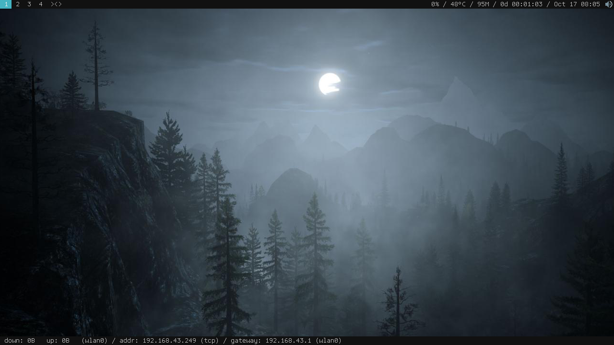

dstatus
=======
A minimalist status monitor for dwm. Inspired from existing [status monitor](https://dwm.suckless.org/status_monitor/).

Build Dependency
----------------
libX11-dev (deb-based package name)
libX11-devel (rpm-based package name)

Compiling & Installing
----------------------
    $ make
    # make install
Before compiling you might want to customize the [config.mk](config.mk) to fit your system.

Running
-------
    $ dstatus &
Or simply add `dstatus &` to your startup script as usual.

Screenshot
----------

